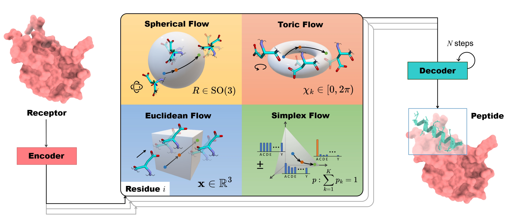

# PepFlow: Full-Atom Peptide Design




This repository contains the official implementation of 💡 Full-Atom Peptide Design based on Multi-modal Flow Matching (ICML 2024).

You can find our [paper](https://arxiv.org/abs/2406.00735) here. We also appreciate the inspiration from [diffab](https://github.com/luost26/diffab) and [frameflow](https://github.com/microsoft/protein-frame-flow).

If you have any questions, please contact lijiahanypc@pku.edu.cn or ced3ljhypc@gmail.com. Thank you! :)

## Install


### Environment

Please replace cuda and torch version to match your machine, here we test our code on CUDA >= 11.7, we also suggest using [micromamba](https://mamba.readthedocs.io/en/latest/installation/micromamba-installation.html) as a replace of conda.

```bash
conda env create -f environment.yml # or use micromamba instead of conda

conda activate flow

pip install torch-scatter -f https://data.pyg.org/whl/torch-2.0.0+cu117.html

pip install joblib lmdb easydict

```

### Clone Repo### Train

```bash
git clone https://github.com/Ced3-han/PepFlowww.git
```

We suggest adding the code to the Python environment variable, or you can use setup tools.

 ```bash
export PYTHONPATH=$(pwd):$PYTHONPATH
python setup.py develop
 ```


### Data and Weights Download

We provide data and pretrained model weights [here](https://drive.google.com/drive/folders/1bHaKDF3uCDPtfsihjZs0zmjwF6UU1uVl?usp=sharing).

+ PepMerge_release.zip: 1.2GB
+ PepMerge_lmdb.zip: 180MB
+ model1.pt: 80MB
+ model2.pt: 80MB

The ```PepMerge_release.zip``` contains filtered data of peptide-receptor pairs. For example, in the folder ```1a0n_A```, the ```P``` chain in the PDB file ```1a0n``` is the peptide. In this folder, we provide the FASTA and PDB files of the peptide and receptor. The postfix _merge means the peptide and receptor are in the same PDB file. We also extract the binding pocket of the receptor, where our model is trained to generate peptides based on the binding pocket. You can also download [PepBDB](http://huanglab.phys.hust.edu.cn/pepbdb/db/1cta_A/) and [QBioLip](https://yanglab.qd.sdu.edu.cn/Q-BioLiP/Download), and use ```playgrounds/gen_dataset```.ipynb to reproduce the dataset.

The ```PepMerge_lmdb.zip``` contains several different splits of the dataset. We use ```mmseqs2``` to cluster complexes based on receptor sequence identity. See ```playgrounds/cluster.ipynb``` for details. The names.txt file contains the names of complexes in the test set. You can use ```models_con/pep_dataloader.py``` to load these datasets. We suggest putting these LMDBs in a single ```Data``` folder.

Besides, ```model1.pt``` and ```model2.pt``` are two checkpoints that you can load using ```models_con/flow_model.py``` together with the config file configs/learn_angle.yaml. We suggest using model1 for benchmark evaluation and model2 for real-world peptide design tasks, the latter is trained on a larger dataset.


## Usage

We will add more user-friendly straightforward pipelines (generation and evaluation) later.

### Inference and Generate

By default, we support sampling of generated peptides from our processed dataset. You can use ```models_con/sample.py``` to sample, and ```models_con/inference.py``` to reconstruct PDB files.

If you want to use your own data, you can organize your data (peptide and pocket) as we did in PepMerge_release and construct a dataset for sampling and reconstruction. You can also use ```models_con/pep_dataloader/preprocess_structure``` to parse a single data point. 


### Evaluation

Our evaluation involves many third-party packages, and we include some useful evaluation scripts in ```eval```. Please refer to our paper for details and download the corresponding packages for evaluation. Please use different python environments for these tools.


### Train

You can also ```train.py``` on single GPU training and ```train_ddp.py``` for multiple GPT training.


## Future Work


Future improvements on peptide generation models may include chemical modifications, non-canonical amino acids, pretraining on larger datasets, language models, better sampling methods, etc. Stay tuned and feel free to contact us for collaboration and discussion!


## Reference

```bibtex
@InProceedings{pmlr-v235-li24o,
  title={Full-Atom Peptide Design based on Multi-modal Flow Matching},
  author={Li, Jiahan and Cheng, Chaoran and Wu, Zuofan and Guo, Ruihan and Luo, Shitong and Ren, Zhizhou and Peng, Jian and Ma, Jianzhu},
  booktitle={Proceedings of the 41st International Conference on Machine Learning},
  pages={27615--27640},
  year={2024},
  editor={Salakhutdinov, Ruslan and Kolter, Zico and Heller, Katherine and Weller, Adrian and Oliver, Nuria and Scarlett, Jonathan and Berkenkamp, Felix},
  volume={235},
  series={Proceedings of Machine Learning Research},
  month=21--27 Jul},
  publisher={PMLR},
}
```